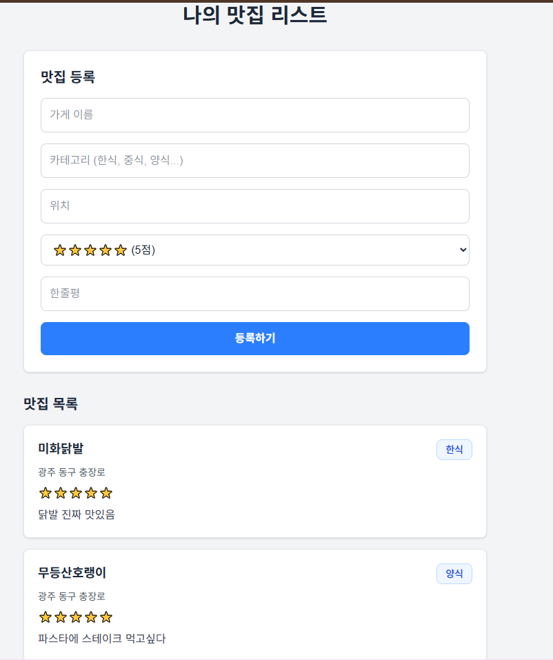

# 맛집 리스트 프로젝트

나만의 맛집을 등록하고 관리하는 웹 애플리케이션

## 프로젝트 소개

방문했던 맛집을 기록하고 싶어서 만든 프로젝트다. 가게 이름, 카테고리, 위치, 별점, 한줄평을 등록할 수 있고,
등록한 맛집들을 목록으로 확인할 수 있다.
단순한 CRUD지만 이번 프로젝트의 핵심은 기능 구현이 아니라 **배포 흐름을 이해하는 것**이었다. 
프론트엔드와 백엔드를 분리하고, Docker로 컨테이너화하고, AWS EC2에 배포하고, GitHub Actions로 자동화하는 과정을 직접 경험해봤다.

## 기술 스택

| 영역 | 기술 |
|------|------|
| Frontend | Next.js, Tailwind CSS |
| Backend | Spring Boot, JPA |
| Database | MySQL |
| DevOps | Docker, Docker Compose, GitHub Actions |
| Infra | AWS EC2 |

## 실행 화면




## 배포 주소

- Frontend: http://43.201.26.159:3000
- Backend API: http://43.201.26.159:8080/api/restaurants


## API 명세

| Method | URL | 설명 |
|--------|-----|------|
| GET | /api/restaurants | 맛집 목록 조회 |
| POST | /api/restaurants | 맛집 등록 |

## 배포 흐름
```
코드 Push → GitHub Actions 실행 → Docker 이미지 빌드 → Docker Hub Push → EC2에서 Pull → 컨테이너 재시작
```

main 브랜치에 Push하면 자동으로 배포된다.

## 삽질 기록

### EC2 메모리 부족
t3.micro가 1GB밖에 안 돼서 MySQL + Backend + Frontend 동시에 돌리니까 서버가 멈췄다. 스왑 메모리 2GB 추가해서 해결했다.

### CORS 에러
로컬에서는 잘 되는데 배포하니까 CORS 에러가 났다. WebConfig에서 EC2 주소도 허용해줘야 했다.

### 브라우저 캐시
코드 수정하고 다시 배포했는데 계속 예전 버전이 보여서 한참 헤맸다. 강력 새로고침(Ctrl+Shift+R)으로 해결.

## 배운 점

- Docker 없이 배포하면 환경 맞추는 게 얼마나 귀찮은지 알게 됐다
- EC2 프리티어는 생각보다 느리다 (스왑 필수)
- CI/CD 한 번 세팅해두면 Push만 하면 되니까 진짜 편하다
- 에러 로그 읽는 습관이 중요하다

## 문서

- [프로젝트 설계](./docs/01-project-design.md)
- [API 명세서](./docs/02-api-spec.md)
- [Docker 구성 설명](./docs/03-docker.md)
- [AWS 배포 설명](./docs/04-deploy.md)
- [CI/CD 설명](./docs/05-cicd.md)
- [프로젝트 회고](./docs/06-retrospective.md)

